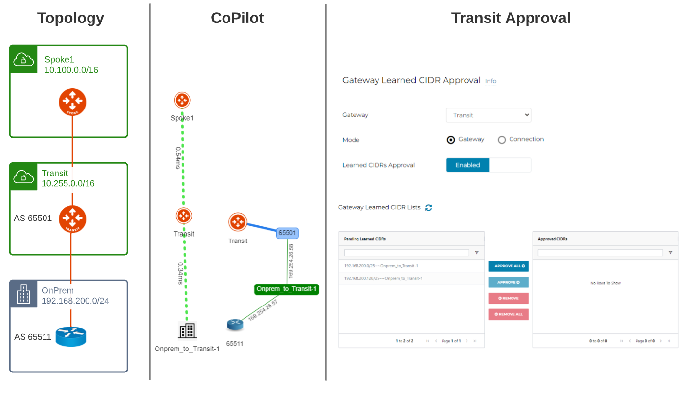

# Aviatrix Transit Approval Demo

This repository provides a Terraform implementation to demonstrate Aviatrix BGP Transit Approval feature: https://docs.aviatrix.com/HowTos/transit_approval.html
Terraform code will deploy:
- Transit VPC and Aviatrix Transit Gateway
- Spoke VPC and Aviatrix Spoke Gateway
- Spoke Gateway to Transit Gateway Attachment
- Simulated On-Prem VPC
- CSR1000V
- Site2Cloud between Transit Gateway and CSR1000V

The code provided is for demo purposes only.



## Prerequisites

Please make sure you have:
- Aviatrix Controller 6.6
- AWS are onboarded. 

## Environment Variables

To run this project, you will need to set the following environment variables

Variables | Description
--- | ---
AVIATRIX_CONTROLLER_IP | Aviatrix Controller IP or FQDN 
AVIATRIX_USERNAME | Aviatrix Controller Username
AVIATRIX_PASSWORD | Aviatrix Controller Password
TF_VAR_aws_account | AWS Aviatrix Account 

## Run Locally

Clone the project

```bash
git clone https://github.com/bayupw/aviatrix-transit-approval-demo
```

Go to the project directory

```bash
cd aviatrix-transit-approval-demo
```

Set environment variables

```bash
export AVIATRIX_CONTROLLER_IP="aviatrixcontroller.aviatrix.lab"
export AVIATRIX_USERNAME="admin"
export AVIATRIX_PASSWORD="aviatrix123"
export TF_VAR_aws_account="AWS-Aviatrix-Account"
```

Terraform workflow

```bash
terraform init
terraform plan
terraform apply -auto-approve
```

## Inputs

| Name | Description | Default | Required |
|------|-------------|---------|----------|
| cloud_supernet | CIDR for the overall supernet | `10.0.0.0/8` | no |
| onprem_supernet | CIDR for the overall supernet | `192.168.0.0/16` | no |
| aws_account | AWS Account for Aviatrix Controller | `null` | yes |
| aws_region | AWS Region | `ap-southeast-2` | no |
| spoke_gws | Number of spoke gateways | `2` | no |
| hpe | Insane mode flag | `false` | no |
| hpe | Insane mode flag | `false` | no |
| ha_gw | Enable HA gateway | `true` | no |